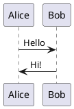

# Quick Start Guide

Get Open UML up and running in 5 minutes!

## For Users

### Download & Install

1. Go to [Releases](https://github.com/choksi2212/open-uml/releases)
2. Download the installer for your OS:
   - Windows: `OpenUML-Setup-*.exe`
   - macOS: `OpenUML-*.dmg`
3. Run the installer
4. Launch Open UML

### First Steps

1. **Start typing** PlantUML code in the editor
2. **Preview updates** automatically after 700ms
3. **Export** your diagram using the Export button
4. **Toggle theme** with the sun/moon icon

### Example

Try this in the editor:



## For Developers

### Prerequisites

- Node.js 20+
- Git

### Setup (5 minutes)

```bash
# 1. Clone
git clone https://github.com/choksi2212/open-uml.git
cd open-uml

# 2. Install
npm install

# 3. Download PlantUML JAR
# Visit https://github.com/plantuml/plantuml/releases
# Download plantuml.jar to app/plantuml/

# 4. Download JRE
# Visit https://adoptium.net/
# Download OpenJDK 17+ JRE for your platform
# Extract to app/plantuml/jre/

# 5. Run
npm run electron:dev
```

### Common Commands

```bash
npm run dev              # Start Vite dev server
npm run electron:dev     # Start Electron + React
npm run build            # Build production
npm run dist             # Create installers
npm run lint             # Check code quality
```

### Project Structure

```
open-uml/
├── app/
│   ├── main/          # Electron main process
│   ├── renderer/      # React UI
│   ├── plantuml/      # PlantUML + JRE (add these)
│   └── assets/        # Icons (optional)
├── .github/           # CI/CD workflows
└── scripts/           # Helper scripts
```

## Troubleshooting

**App won't start?**
- Check that PlantUML JAR exists: `app/plantuml/plantuml.jar`
- Check that JRE exists: `app/plantuml/jre/bin/java` (or `java.exe` on Windows)

**Build fails?**
- Ensure all dependencies: `npm install`
- Check Node.js version: `node --version` (should be 20+)

**Rendering doesn't work?**
- Verify PlantUML JAR is valid
- Check JRE is executable (macOS/Linux): `chmod +x app/plantuml/jre/bin/java`

## Next Steps

- Read [README.md](README.md) for full documentation
- See [SETUP.md](SETUP.md) for detailed setup
- Check [CONTRIBUTING.md](CONTRIBUTING.md) to contribute

