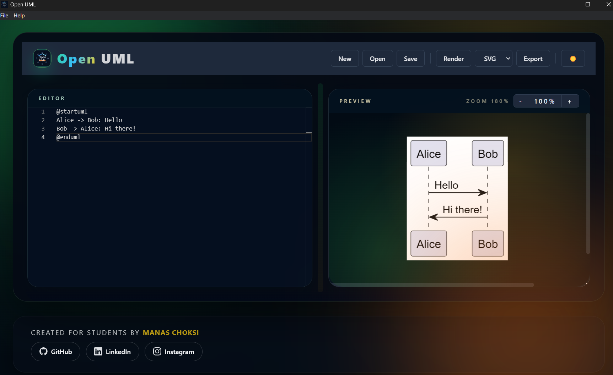
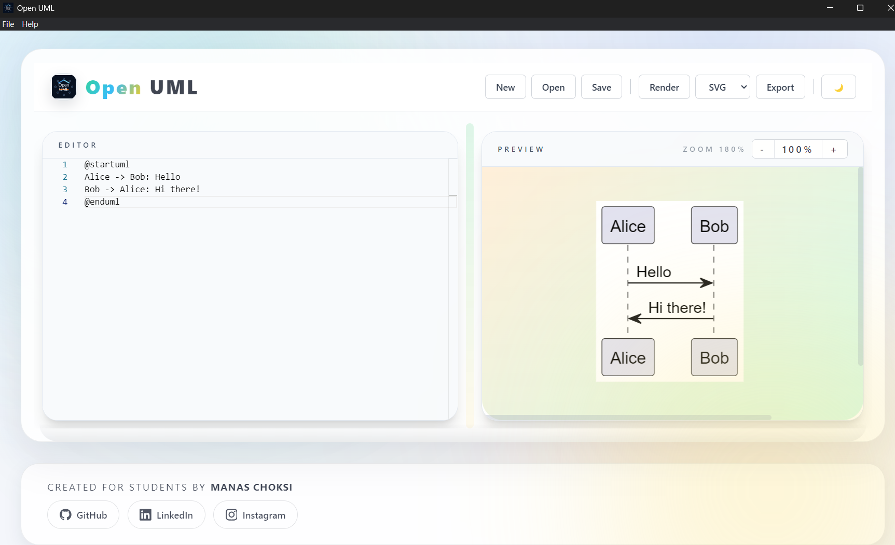

<div align="center">

# Open UML

**An offline PlantUML editor for the desktop. Bundled JRE. No accounts. No Java install dance.**


[**Download**](https://github.com/choksi2212/open-uml/releases) · [**Docs**](#-architecture) · [**Changelog**](CHANGELOG.md) · [**Report bug**](https://github.com/choksi2212/open-uml/issues)


*Dark theme*


*Light theme*

</div>

---

## Why

PlantUML is the right way to draw diagrams — version-controlled, plain text, automatable. The web editors force you online, the JVM setup is friction, and the existing desktop tools feel like relics from 2008. Open UML is a desktop app that runs entirely offline, bundles its own JRE, and feels like a modern IDE.

| | |
|---|---|
| **Offline** | Zero network calls except a one-shot update check against GitHub. No telemetry, no analytics, no upload. |
| **Live preview** | Diagrams render as you type (300 ms debounce). Multi-diagram files show tabs. |
| **Professional editor** | Monaco with PlantUML syntax highlighting, autocomplete snippets, find/replace, multi-cursor, bracket pair colorization. |
| **Export anywhere** | PNG, SVG, PDF — or copy the rendered diagram straight to your clipboard. |
| **Themed** | Cyan-teal accent on either a deep slate (dark) or warm paper (light) surface. |
| **Free, MIT** | Use it, fork it, ship it. |

---

## Architecture

Open UML is a standard Electron app — a Chromium renderer driving a Node.js main process, communicating over a typed IPC bridge. The interesting bit is that almost all the design work happens at the boundary: PlantUML rendering is delegated to a bundled JRE subprocess; the rest is plain React.

```
┌──────────────────────────────────────────────────────────────────────────┐
│                          Electron (Chromium + Node)                        │
│                                                                            │
│  ┌──────────────────────┐        IPC         ┌──────────────────────────┐  │
│  │      Renderer        │ ◄────────────────► │       Main Process      │  │
│  │  (React + Monaco)    │   electronAPI      │       (Node.js)          │  │
│  │                      │                    │                          │  │
│  │  App.tsx ────────────── state + handlers ─►│  app/main/index.ts      │  │
│  │  ├─ TopBar            │                    │  ├─ createWindow()       │  │
│  │  ├─ Editor (Monaco)   │                    │  ├─ IPC handlers         │  │
│  │  ├─ Preview (SVG)     │                    │  ├─ electron-updater     │  │
│  │  ├─ StatusBar         │                    │  ├─ application menu    │  │
│  │  ├─ CommandPalette    │                    │  └─ single-instance lock│  │
│  │  ├─ ErrorPanel        │                    │                          │  │
│  │  └─ ErrorBoundary     │                    │  app/main/plantuml-parser │  │
│  │                      │                    │  ├─ splitDiagrams()      │  │
│  │  lib/                 │                    │  ├─ parsePlantumlError() │  │
│  │  ├─ constants.ts      │                    │  └─ looksLikeErrorImage()│  │
│  │  ├─ cn.ts (className)│                    │                          │  │
│  │  ├─ monaco-plantuml.ts│                    │  preload.ts              │  │
│  │  └─ hooks/            │                    │  └─ contextBridge →      │  │
│  │     ├─ useLocalStorage│                   │     window.electronAPI   │  │
│  │     └─ useEditorSettings│                 │                          │  │
│  └──────────────────────┘                    └──────────────────────────┘  │
│                                                       │                    │
│                                                       │ spawn()              │
│                                                       ▼                    │
│                                          ┌──────────────────────────┐        │
│                                          │  bundled JRE + PlantUML  │        │
│                                          │  plantuml.jar            │        │
│                                          │  plantuml-pdf.jar        │        │
│                                          │  (live rendering,        │        │
│                                          │   fully offline)         │        │
│                                          └──────────────────────────┘        │
└──────────────────────────────────────────────────────────────────────────┘
```

### Rendering pipeline

1. User types into Monaco (debounced 300 ms).
2. `App.tsx` calls `window.electronAPI.renderDiagram({ source, format })`.
3. **Main process** splits the source on `@startXXX…@endXXX` blocks (`splitDiagrams`). PlantUML's `-pipe` mode renders only the first block — splitting lets us render every block in parallel.
4. For each block, **main process** spawns the bundled JRE:
   ```
   java -cp <plantuml.jar;plantuml-pdf.jar> net.sourceforge.plantuml.Run -tsvg -pipe
   ```
5. Output is a base64 data URL (`data:image/svg+xml;base64,…`) returned to the renderer.
6. **Renderer** decodes the data URL and inlines the SVG (text becomes selectable, copyable, themable).

### IPC contract

All renderer ↔ main communication goes through the typed `window.electronAPI` exposed by `preload.ts`. Twelve methods, no globals, no `nodeIntegration`. Security defaults: `contextIsolation: true`, `nodeIntegration: false`, sandbox-friendly preload.

| Method | Direction | Purpose |
|---|---|---|
| `renderDiagram({ source, format })` | renderer → main | Render PlantUML source. Returns base64 SVG/PNG data URLs. |
| `exportDiagram({ data, format })` | renderer → main | Save the current preview to disk via `showSaveDialog`. |
| `exportPdf(source, defaultPath)` | renderer → main | Render to PDF via the bundled `plantuml-pdf` companion jar. |
| `copyImage(data, format)` | renderer → main | PNG to clipboard as a real image; SVG as vector text. |
| `openFile()` / `saveFile()` / `saveAsFile()` | renderer ↔ main | Standard file dialogs. |
| `readFileByPath(path)` | renderer → main | Drag-and-drop open (no dialog). |
| `checkUpdates()` | renderer → main | GitHub Releases check; never auto-installs. |
| `onMenuAction(cb)` / `onRecentFileOpened(cb)` / `onOsOpenedFile(cb)` | main → renderer | Push native menu actions and OS-opened files. |
| `openExternal(url)` | renderer → main | Open URL in default browser. |

---

## Design system

A deliberate palette for an engineering drawing tool. Not the SaaS-AI default.

### Colour tokens

| Token | Light | Dark | Role |
|---|---|---|---|
| `--bg` | `#fafaf9` | `#0a1218` | Page surface |
| `--bg-elevated` | `#ffffff` | `#0f1721` | Cards, app panels |
| `--surface-1` / `-2` / `-3` | `#f4f4f3` / `#ebebe9` / `#dcdcd8` | `#131c26` / `#1a2632` / `#2a3645` | Hover, dividers, selected |
| `--fg` | `#1a1a1a` | `#f0fdfa` | Primary text |
| `--fg-muted` | `#57534e` | `#94a3b8` | Secondary text |
| `--accent` | `#0f766e` (teal-700) | `#22d3ee` (cyan-400) | Action, focus, link |
| `--warn` | `#b45309` | `#fbbf24` | Warnings, errors |
| `--danger` | `#b91c1c` | `#f87171` | Destructive actions |

Single accent per composition. No gradients on chrome. No shadows on text. No glass effects.

### Typography

| Use | Family | Weight |
|---|---|---|
| UI, body, headings | IBM Plex Sans | 400 / 500 / 600 |
| Code, editor | IBM Plex Mono | 400 / 500 |
| Display wordmark | IBM Plex Sans SemiBold (traced) | 600 |

Self-hosted via `@fontsource/*` packages — the editor opens without a network.

### Layout

- **Single accent per composition.** Borders are 1px in the border token — not the SaaS "soft grey shadow under every card" kit.
- **One bold element.** A subtle dot-grid background fills the preview pane (engineering graph paper). Nowhere else.
- **Generous negative space.** When in doubt, remove.

### Component primitives

Seven primitives under `app/renderer/components/ui/`: `Button`, `IconButton`, `Toggle`, `Tooltip`, `Badge`, `Separator`, `Select`. Every other component is composed from these.

---

## Tech stack

| | |
|---|---|
| Shell | Electron 28 |
| UI | React 18 + TypeScript 5 |
| Build | Vite 5 + `vite-plugin-electron` |
| Styles | Tailwind CSS 3 (semantic tokens, no color ramp leakage) |
| Editor | Monaco (`@monaco-editor/react`) with a custom PlantUML language definition |
| Icons | `lucide-react` |
| Rendering engine | PlantUML (bundled JAR + `plantuml-pdf` companion) |
| Runtime | Bundled OpenJDK JRE — Windows JRE on Windows builds, macOS JRE on macOS builds |
| Tests | Vitest 2 |
| Lint | ESLint 8 + `@typescript-eslint` |
| Packaging | electron-builder 24 |

---

## Project layout

```
open-uml/
├── app/
│   ├── main/                          # Electron main process
│   │   ├── index.ts                   # Window, IPC, menu, auto-update
│   │   ├── plantuml-parser.ts         # Pure functions (testable)
│   │   └── plantuml-parser.test.ts    # 21 Vitest cases
│   ├── preload.ts                     # contextBridge → window.electronAPI
│   ├── renderer/                      # React UI
│   │   ├── App.tsx
│   │   ├── components/
│   │   │   ├── Editor.tsx
│   │   │   ├── Preview.tsx
│   │   │   ├── TopBar.tsx
│   │   │   ├── StatusBar.tsx
│   │   │   ├── CommandPalette.tsx
│   │   │   ├── ErrorPanel.tsx
│   │   │   ├── ErrorBoundary.tsx
│   │   │   └── ui/                    # Primitives
│   │   ├── lib/
│   │   │   ├── constants.ts           # Magic numbers + storage keys
│   │   │   ├── cn.ts                  # clsx + tailwind-merge
│   │   │   └── monaco-plantuml.ts     # Language + themes + snippets
│   │   └── hooks/
│   │       ├── useLocalStorage.ts
│   │       └── useEditorSettings.ts
│   ├── assets/                        # Logos, app icons (auto-regenerated)
│   └── plantuml/                      # JAR + JRE (platform-scoped at build)
├── docs/landing/                       # Static landing page (Vercel/Netlify)
├── logo-family/                        # Brand masters (SVG + PNG + font)
├── scripts/
│   ├── regenerate-icons.py             # Pillow-only icon regenerator
│   └── setup-plantuml.md
├── public/
│   └── favicon.svg
├── .claude/launch.json                # Browser preview server
├── preview.cjs                        # Tiny static server (dev only)
├── .github/workflows/release.yml
├── CHANGELOG.md
├── DEPLOY.md                          # Launch checklist (certs, notarization)
├── LICENSE
├── README.md
├── electron-builder.yml
├── tailwind.config.js
├── postcss.config.js
├── vite.config.ts
├── vitest.config.ts
└── package.json
```

---

## Getting started

### Install

Download the latest installer for your platform from the [Releases page](https://github.com/choksi2212/open-uml/releases).

| Platform | File | Notes |
|---|---|---|
| Windows | `OpenUML-Setup-X.Y.Z.exe` | NSIS installer. No SmartScreen warning once code-signed (see `DEPLOY.md`). |
| macOS | `OpenUML-X.Y.Z.dmg` | Drag to Applications. First launch: right-click → Open if Gatekeeper blocks. |

### Use

1. Launch Open UML.
2. Type PlantUML in the left pane — the preview renders as you type.
3. Save with `Ctrl+S` / `Cmd+S`. The file extension `.puml` is preferred but `.plantuml`, `.iuml`, `.pu`, and `.txt` all work.
4. Export via `Ctrl+Shift+G` (SVG) / `Ctrl+Shift+P` (PNG) / `Ctrl+Shift+?` (PDF).

### Keyboard shortcuts

| Shortcut | Action |
|---|---|
| `Ctrl+N` / `Cmd+N` | New |
| `Ctrl+O` / `Cmd+O` | Open |
| `Ctrl+S` / `Cmd+S` | Save |
| `Ctrl+Shift+S` / `Cmd+Shift+S` | Save as |
| `Ctrl+Shift+R` / `Cmd+Shift+R` | Render |
| `Ctrl+Shift+G` / `Cmd+Shift+G` | Export SVG |
| `Ctrl+Shift+P` / `Cmd+Shift+P` | Export PNG |
| `Ctrl+Shift+C` / `Cmd+Shift+C` | Copy image |
| `Ctrl+Shift+K` / `Cmd+Shift+K` | Command palette |
| `Ctrl+Scroll` | Zoom preview |
| `Space + drag` | Pan preview |

---

## Development

### Prerequisites

- Node.js 20+
- npm
- Git

### Setup

```bash
git clone https://github.com/choksi2212/open-uml.git
cd open-uml
npm install
```

The JRE + PlantUML jars are committed at `app/plantuml/` so there's nothing to fetch.

### Commands

| Command | Description |
|---|---|
| `npm run dev` | Vite dev server only |
| `npm run electron:dev` | Vite + Electron together |
| `npm run build` | Production build (renderer + main + preload) |
| `npm test` | Run Vitest |
| `npm run test:watch` | Vitest in watch mode |
| `npm run test:coverage` | Vitest with coverage report |
| `npm run lint` | ESLint |
| `npm run dist` | Build installers via electron-builder |
| `npm run release` | Build + create GitHub release |

### Regenerating icons

The `app/assets/` icons are derived from `logo-family/` masters. After any logo update:

```bash
python scripts/regenerate-icons.py
```

Outputs (via Pillow — no ImageMagick needed):

- `app/assets/icon.ico` — Windows multi-size (16/24/32/48/64/128/256)
- `app/assets/icon.icns` — macOS (1024×1024)
- `app/assets/_lockup-light.svg` / `_lockup-dark.svg` — TopBar lockup
- `public/favicon.svg` — Browser favicon
- `app/assets/social-avatar.png` — GitHub / Twitter avatar

---

## Building installers

```bash
npm run dist
```

Outputs land in `build/`:

- `build/OpenUML-Setup-2.0.0.exe` — Windows NSIS
- `build/OpenUML-2.0.0.dmg` — macOS

Each platform packages only its own JRE. The macOS CI job mounts the produced DMG and asserts that `bin/java` is a Mach-O binary — that's the regression guard for the v1.0.1 bug where Windows JRE ended up in the macOS DMG.

### Code signing + notarization

See **[DEPLOY.md](DEPLOY.md)** for the actual launch checklist. The short version: buy a Windows EV cert and an Apple Developer account, set the GitHub secrets, replace `identity: null` in `electron-builder.yml` with your real signing identity. Without these, users will see SmartScreen on Windows and the right-click → Open flow on macOS.

### Auto-update

Packaged builds use `electron-updater` against the GitHub Releases feed. A new tag on `main` triggers the release workflow, which produces installers, attaches them to a GitHub release, and clients auto-download + prompt to install on quit. Unsigned builds fall back to a manual `Help → Check for Updates` flow.

---

## Contributing

Pull requests welcome. Conventional commits preferred (`feat:`, `fix:`, `docs:`, `refactor:`, `chore:`, `test:`).

For larger changes, please open an issue first to discuss the approach. Test additions go alongside the change they cover — `splitDiagrams`, `parsePlantumlError`, and `looksLikeErrorImage` are the obvious places for new parser logic.

---

## Acknowledgements

- [PlantUML](https://plantuml.com/) — the rendering engine that makes this possible.
- [Electron](https://www.electronjs.org/), [React](https://react.dev/), [Vite](https://vitejs.dev/), [Tailwind CSS](https://tailwindcss.com/), [Monaco Editor](https://microsoft.github.io/monaco-editor/), [Lucide](https://lucide.dev/) — the foundation.
- [IBM Plex](https://www.ibm.com/plex/) — the typography that gives the app its voice.

---

## License

[MIT](LICENSE) © Open UML contributors.
